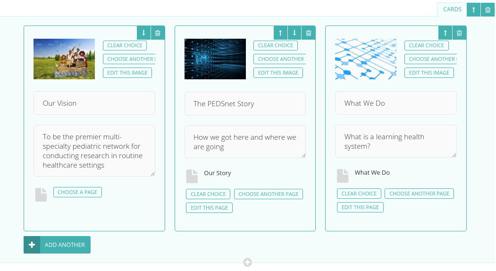

Wagtail Blocks: Cards
=====================

This Wagtail block can be used to add a series of cards. It is styled on the editor screen.

Installation
------------

Run:

    pip install wagtailblocks-cards

Then add `wagtailblocks_cards` to your installed apps.

Usage
-----

A CardsBlock is just a ListBlock with extra styling on the editor screen. Use it the exact same way as a ListBlock.

    from wagtailblocks_cards.blocks import CardsBlock

Then:

    body = StreamField([
      ('cards', CardsBlock(MyCustomBlock()))
    ])

Replace `MyCustomBlock()` with a custom block of your choice.

Finally, template as usual.

Notes
-----

You can also add a CardsBlock inside of a StructBlock or other structual block types for more control. You may want to inject more custom CSS to make it span the full width if you aren't using help text, or change the number of columns.

If [wagtailfontawesome](https://github.com/alexgleason/wagtailfontawesome) is installed, this app will detect it and use [fa-clone](http://fontawesome.io/icon/clone/) by default.
